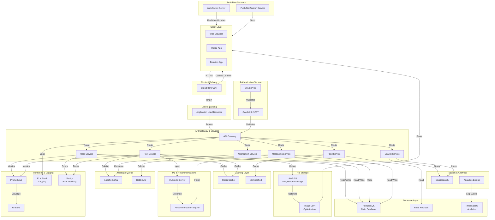

# Instagram-Like Social Media Application Architecture

## Overview

This document outlines the architecture of an Instagram-like social media application, detailing how various components interact to deliver a scalable, reliable, and performant platform.

## System Architecture Diagram

## Component Descriptions

### Client Layer
- **Web Browser**: React/Vue.js frontend application
- **Mobile App**: Native iOS (Swift) and Android (Kotlin) applications
- **Desktop App**: Electron or native desktop application

### Content Delivery
- **CloudFlare CDN**: Global content distribution and DDoS protection

### Load Balancing
- **Application Load Balancer (ALB)**: Distributes traffic across multiple servers

### Authentication Service
- **OAuth 2.0 / JWT**: Secure user authentication and authorization
- **2FA Service**: Two-factor authentication for enhanced security

### API Services
- **API Gateway**: Central entry point for all API requests
- **User Service**: Manages user profiles, settings, and relationships
- **Post Service**: Handles post creation, editing, and deletion
- **Feed Service**: Generates personalized user feeds
- **Notification Service**: Manages notifications and alerts
- **Search Service**: Provides search functionality for users and posts
- **Messaging Service**: Handles direct messaging between users

### Caching Layer
- **Redis**: In-memory cache for high-speed data retrieval
- **Memcached**: Distributed memory caching

### Database Layer
- **PostgreSQL**: Primary relational database for core data
- **Read Replicas**: Improve read performance and availability
- **TimescaleDB**: Time-series database for analytics and metrics

### File Storage
- **AWS S3**: Scalable object storage for images and videos
- **Image CDN**: Optimizes and serves images globally

### Message Queue
- **Apache Kafka**: High-throughput event streaming
- **RabbitMQ**: Message broker for asynchronous tasks

### Real-Time Services
- **WebSocket Server**: Enables real-time communication
- **Push Notification Service**: Sends notifications to users

### Search & Analytics
- **Elasticsearch**: Full-text search capabilities
- **Analytics Engine**: Processes and analyzes user data

### ML & Recommendations
- **ML Model Server**: Runs machine learning models
- **Recommendation Engine**: Generates personalized recommendations

### Monitoring & Logging
- **Prometheus**: Metrics collection and monitoring
- **Grafana**: Data visualization and dashboards
- **ELK Stack**: Centralized logging (Elasticsearch, Logstash, Kibana)
- **Sentry**: Error tracking and performance monitoring

## Data Flow

1. **User Request**: Client sends request through CDN to ALB
2. **Routing**: ALB routes to API Gateway based on request type
3. **Authentication**: Request is validated through OAuth/JWT
4. **Processing**: Appropriate microservice processes the request
5. **Caching**: Service checks cache for frequently accessed data
6. **Database**: Data is fetched or updated in PostgreSQL
7. **Response**: Service returns response through API Gateway
8. **Delivery**: Response is sent back to client through CDN

## Scalability Features

- **Horizontal Scaling**: Multiple instances of each service
- **Database Replication**: Read replicas for distributed reads
- **Caching Strategy**: Redis and Memcached for reduced DB load
- **Message Queues**: Asynchronous processing of non-critical tasks
- **CDN**: Global content distribution reducing latency

## Security Features

- **HTTPS/TLS**: End-to-end encryption
- **OAuth 2.0**: Industry-standard authentication
- **2FA**: Multi-factor authentication
- **DDoS Protection**: CloudFlare DDoS mitigation
- **Secrets Management**: Secure credential storage

## Disaster Recovery

- **Database Backups**: Automated daily backups
- **Replication**: Data replicated across multiple regions
- **Failover**: Automatic failover to read replicas
- **Monitoring Alerts**: Real-time alerts for issues

---

**Last Updated**: June 2026
